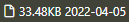
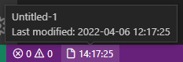

# File Status

---

## Features

Display different file properties like file size or modification date in the status bar.

For the modification time the following rule applies: If the modification date is the same as the actual date, the modification time is shown. Otherwise the modification date is shown.

Some examples:

* File size and modification time. The file was modified today, so showing modifcation time

  

* File size and modification date. Showing only the date since the File was modified on an earlier date.

  

* File name and file size:  

  

* Tooltip of a new file:

  

## Extension Settings

This extension contributes the following settings:

* `pmFileStatus.displayFileName`: display the filename
* `pmFileStatus.displayFileSize`: display the file size
* `pmFileStatus.displayFileModificationTime`: display the modification time of the file

<!-- ## Known Issues

Calling out known issues can help limit users opening duplicate issues against your extension. -->

## Release Notes

### 1.0.0

* added handling of new files
* update data on click

### 0.9.0

Initial release of File Status
